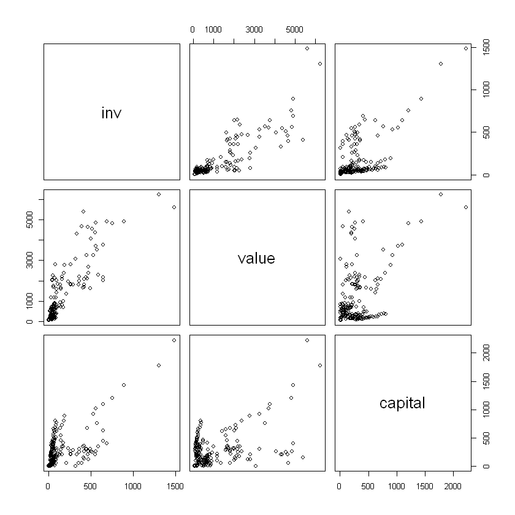
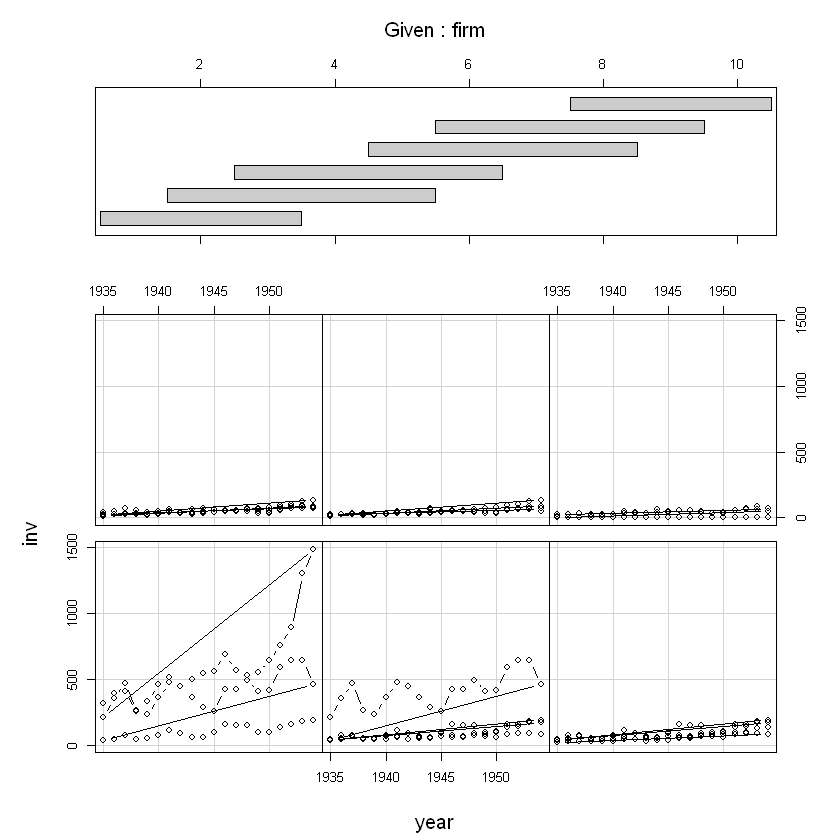
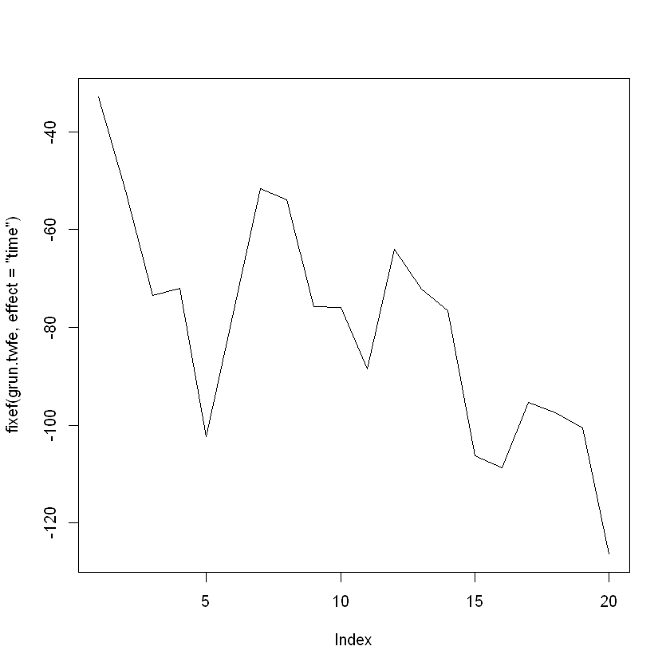

# Ejemplo Datos de Panel (usando R)

Recordemos, un modelo de datos de panel parte de la siguiente ecuación:

<a href="https://www.codecogs.com/eqnedit.php?latex=\large&space;Y_{it}&space;=&space;\beta_{0}&space;&plus;&space;\beta_{1}X_{it}&space;&plus;&space;\beta_{2}K_{it}&space;&plus;&space;e_{it}" target="_blank"></a>

Esto dado el caso ideal, pero puede suceder que se requiera identificar el efecto aleatorio, por lo tanto se tiene:

<a href="https://www.codecogs.com/eqnedit.php?latex=\large&space;Y_{it}&space;=&space;\beta_{0}&space;&plus;&space;\beta_{1}X_{it}&space;&plus;&space;\beta_{2}&space;K_{it}&space;&plus;&space;\underbrace{C_{i}&space;&plus;&space;D_{t}&space;&plus;&space;\varepsilon_{it}}_{e_{it}}" target="_blank"></a>

## ¿Cuál es el enfoque del software?

Como se sabe, los datos de panel tienen una estructura especial: cada fila de datos corresponde a un individuo específico en un periodo de tiempo. En **R**, existe una librería (o paquete) diseñado de manera específica para el tratamiento de este tipo de datos llamada `plm`, la cual debe instalarse porque no corresponde a las librerías suminstradas por defecto.

En `plm` el argumento de los datos corresponde a un `data.frame` ordinario pero el argumento llamado `index` ha sido añadido para indicar la estructura de los datos y puede presentar varias formas:

 * `NULL` (valor por defecto). El programa asume que las dos primeras columnas corresponden a los individuos y el indicador temporal y las observaciones están ordenadas por individuo y por periodo de tiempo
 * Una cadena de caracteres, que debería ser el nombre del índice de cada individuo
 * Un vector de caracteres de longitud dos conteniendo el nombre de los individuos y el indicador del tiempo
 * Un entero que es el número de individuos (solo en el caso de un panel equilibrado con observaciones ordenadas por individuo)
 
`plm` proporciona cuatro funciones para la estimación:
 * `plm`: estimación de los modelos básicos de panel, es decir, dentro, entre y modelos de efectos aleatorios. Los modelos se estiman utilizando la función `lm` para datos transformados,
 * `pvcm`: estimación por coeficientes variables,
 * `pgmm`: estimación por Momentos,
 * `pggls`: estimación por Mínimos Cuadrados Generalizados
 
La interfaz de estas funciones son compatibles con la función `lm()` en los dos primeros argumetos `formula` y `data` mostrando tres argumentos adiconales:
 * `index`: permite identificar la estructura de los datos
 * `effect`: los efectos que se desean incluir en el modelo: individuos, de tiempo o ambos
 * `model`: el tipo de modelo a ser estimado, la mayoría de las veces un modelo con efectos fijos o un modelo con efectos aleatorios

## Conjunto de Datos

Para el ejemplo se van a emplear los conjuntos de datos suministrados por el programa (en el taller correspondiente, los estudiantes trabajarán con un conjunto de datos específicos).

Se trata de cuatro conjuntos de datos:
 * `EmplUK`: del paquete `plm`usado por Arellano & Bond (1991)
 * `Grunfeld`: del paquete `Ecdat` (Croissant 2006) usado en varios libros de texto de econometría
 * `Produc`: del paquete `Ecdat` usado por Munnell (1990)
 * `Wages`: del paquete `Ecdat` usado por Cornwell & Rupert (1988)

Para entender cómo se deben organizar lo datos: Si el conjunto de datos `Wages` careciera de índices por completo, pero se supiera (ya se verá cómo) que es un panel equilibrado ya ordenado (id, tiempo), estos pueden ser explícitamente reconstruidos y puestos en las primeras dos columnas por la función `plm.data` especificando el número de individuos:

~~~
Wages <- plm.data(Wages, index = 595)
~~~

Ahora, si fuera un conjunto de datos que tuviera índices pero estuvieran, o se sospechara que están, en el orden incorrecto se puede configurar de la misma manera especificando los nombres de los índices de individuos y tiempo. Si el conjunto de datos `EmplUK`estuviera desordenado se usaría:

~~~
EmplUK <- plm.data(EmplUK, index = c("firm", "year"))
~~~

### Procedemos a llamar los datos.
Como se tratan de conjuntos de datos suministrados como ejemplos en las librerías se debe, primero, proceder a instalarlas, si las librerías no están instaladas, usando el comando `install.packages()`. Antes de instalar, es recomendable construir un objeto que contenga los nombres de los paquetes a instalar.

Vamos a llamar a ese objeto `packs` y lo vamos a construir como un vector de caracteres:


```R
packs<-c("plm","Ecdat")
install.packages(packs)
```

    Installing packages into 'C:/Users/Carlos Mantilla/Documents/R/win-library/3.5'
    (as 'lib' is unspecified)
    

    package 'plm' successfully unpacked and MD5 sums checked
    package 'Ecdat' successfully unpacked and MD5 sums checked
    
    The downloaded binary packages are in
    	C:\Users\Carlos Mantilla\AppData\Local\Temp\RtmpwtcE6g\downloaded_packages
    

Se observa que hubo más librerías instaladas, eso es normal, son librerías de apoyo en la ejecución de funciones. Dependiendo del tamaño de las librerías, el proceso puede o no demorar.

Ahora, carguemos las librerías y los conjuntos de datos:


```R
library("plm")
library("Ecdat")
data("EmplUK", package = "plm")
data("Produc", package = "Ecdat")
data("Grunfeld", package = "Ecdat")
data("Wages", package = "Ecdat")
```

Para conocer el contenido de cada base de datos podemos usar la función `help()`, de este modo podremos saber cuál es la estructura de los datos. Para el ejercicio, vamos a emplear el conjunto de datos llamado `Grunfeld`. El contenido es el siguiente:

|Variale | Descripción|
|:-----|:------------|
|firm | Observación|
|year | fecha|
|inv | Inversión Bruta|
|value | Valor de la firma|
|capital| Existencias en Planta y Equipo|

Y se presenta de la siguiente manera:


```R
head(Grunfeld)
```


<table>
<thead><tr><th scope=col>firm</th><th scope=col>year</th><th scope=col>inv</th><th scope=col>value</th><th scope=col>capital</th></tr></thead>
<tbody>
	<tr><td>1     </td><td>1935  </td><td>317.6 </td><td>3078.5</td><td>  2.8 </td></tr>
	<tr><td>1     </td><td>1936  </td><td>391.8 </td><td>4661.7</td><td> 52.6 </td></tr>
	<tr><td>1     </td><td>1937  </td><td>410.6 </td><td>5387.1</td><td>156.9 </td></tr>
	<tr><td>1     </td><td>1938  </td><td>257.7 </td><td>2792.2</td><td>209.2 </td></tr>
	<tr><td>1     </td><td>1939  </td><td>330.8 </td><td>4313.2</td><td>203.4 </td></tr>
	<tr><td>1     </td><td>1940  </td><td>461.2 </td><td>4643.9</td><td>207.2 </td></tr>
</tbody>
</table>


Algunas gráficas que no sobran:


```R
plot(Grunfeld[,c(3:5)])
```





```R
coplot(inv ~ year|firm, type="b", data=Grunfeld)  
```





Ahora, vamos a estimar el modelo; el primero será el modelo de efectos fijos y el segundo el de efectos aleatorios. Pero, conozcamos los argumentos de la función que vamos a emplear:


```R
args(plm)
```


<pre class=language-r><code>function (formula, data, subset, weights, na.action, effect = c("individual", 
<span style=white-space:pre-wrap>    "time", "twoways", "nested"), model = c("within", "random", </span>
<span style=white-space:pre-wrap>    "ht", "between", "pooling", "fd"), random.method = NULL, </span>
<span style=white-space:pre-wrap>    random.models = NULL, random.dfcor = NULL, inst.method = c("bvk", </span>
<span style=white-space:pre-wrap>        "baltagi", "am", "bms"), restrict.matrix = NULL, restrict.rhs = NULL, </span>
<span style=white-space:pre-wrap>    index = NULL, ...) </span>
NULL</code></pre>


Para nuestro modelo, vamos a plantear que la _Inversión Bruta_ es función del _Valor de la Firma_ y de las _Exsitencias en Planta y Equipo_; el modelo sería algo así:

<a href="https://www.codecogs.com/eqnedit.php?latex=\large&space;inv_{it}&space;=&space;\beta_{0}&space;&plus;&space;\beta_{1}value_{it}&space;&plus;&space;\beta_{2}capital_{it}&space;&plus;&space;e_{it}" target="_blank"></a>

Vamos, ahora, a plantear dos expresiones: una para los efectos fijos y otra para los efectos aleatorios. En código quedan de la siguiente manera:


```R
grun.fe <- plm(inv ~ value + capital, data = Grunfeld, model = "within") # Efectos Fijos
grun.re <- plm(inv ~ value + capital, data = Grunfeld, model = "random") # Efectos Aleatorios
```

Hemos cosntruido dos modelos: `grun.fe` el modelo de _efectos fijos_ y `grun.re` el modelo de _efectos aleatorios_. Solicitemos un resumen general del modelo de efectos fijos


```R
summary(grun.fe)
```


    Oneway (individual) effect Within Model
    
    Call:
    plm(formula = inv ~ value + capital, data = Grunfeld, model = "within")
    
    Balanced Panel: n = 10, T = 20, N = 200
    
    Residuals:
          Min.    1st Qu.     Median    3rd Qu.       Max. 
    -184.00857  -17.64316    0.56337   19.19222  250.70974 
    
    Coefficients:
            Estimate Std. Error t-value  Pr(>|t|)    
    value   0.110124   0.011857  9.2879 < 2.2e-16 ***
    capital 0.310065   0.017355 17.8666 < 2.2e-16 ***
    ---
    Signif. codes:  0 '***' 0.001 '**' 0.01 '*' 0.05 '.' 0.1 ' ' 1
    
    Total Sum of Squares:    2244400
    Residual Sum of Squares: 523480
    R-Squared:      0.76676
    Adj. R-Squared: 0.75311
    F-statistic: 309.014 on 2 and 188 DF, p-value: < 2.22e-16


Veamos, específicamente, los coeficiente


```R
summary(grun.fe)$coeff
```


<table>
<thead><tr><th></th><th scope=col>Estimate</th><th scope=col>Std. Error</th><th scope=col>t-value</th><th scope=col>Pr(&gt;|t|)</th></tr></thead>
<tbody>
	<tr><th scope=row>value</th><td>0.1101238   </td><td>0.01185669  </td><td> 9.287901   </td><td>3.921108e-17</td></tr>
	<tr><th scope=row>capital</th><td>0.3100653   </td><td>0.01735450  </td><td>17.866564   </td><td>2.220007e-42</td></tr>
</tbody>
</table>


En el resumen se observa: `n=10`;  `T=20` y `N=200` que corresponde al número de empresas o firmas, el número de periodos registrados y el total de observaciones respectivamente. Se observa, además, los valores de los coeficientes y su significancia:

|        |Estimate| Std. Error| t-value|  $Pr(>|t|)$|
|:-------|-------:|----------:|-------:|---------:|
|value   |0.110124|   0.011857|  9.2879| < 2.2e-16|
|capital |0.310065|   0.017355| 17.8666| < 2.2e-16|

Ahora, vemos el modelo de efectos aleatorios


```R
summary(grun.re)
```


    Oneway (individual) effect Random Effect Model 
       (Swamy-Arora's transformation)
    
    Call:
    plm(formula = inv ~ value + capital, data = Grunfeld, model = "random")
    
    Balanced Panel: n = 10, T = 20, N = 200
    
    Effects:
                      var std.dev share
    idiosyncratic 2784.46   52.77 0.282
    individual    7089.80   84.20 0.718
    theta: 0.8612
    
    Residuals:
         Min.   1st Qu.    Median   3rd Qu.      Max. 
    -177.6063  -19.7350    4.6851   19.5105  252.8743 
    
    Coefficients:
                  Estimate Std. Error t-value Pr(>|t|)    
    (Intercept) -57.834415  28.898935 -2.0013  0.04674 *  
    value         0.109781   0.010493 10.4627  < 2e-16 ***
    capital       0.308113   0.017180 17.9339  < 2e-16 ***
    ---
    Signif. codes:  0 '***' 0.001 '**' 0.01 '*' 0.05 '.' 0.1 ' ' 1
    
    Total Sum of Squares:    2381400
    Residual Sum of Squares: 548900
    R-Squared:      0.7695
    Adj. R-Squared: 0.76716
    F-statistic: 328.837 on 2 and 197 DF, p-value: < 2.22e-16


```R
summary(grun.re)$coeff
```


<table>
<thead><tr><th></th><th scope=col>Estimate</th><th scope=col>Std. Error</th><th scope=col>t-value</th><th scope=col>Pr(&gt;|t|)</th></tr></thead>
<tbody>
	<tr><th scope=row>(Intercept)</th><td>-57.8344149 </td><td>28.89893526 </td><td>-2.001265   </td><td>4.673626e-02</td></tr>
	<tr><th scope=row>value</th><td>  0.1097812 </td><td> 0.01049266 </td><td>10.462658   </td><td>1.174788e-20</td></tr>
	<tr><th scope=row>capital</th><td>  0.3081130 </td><td> 0.01718047 </td><td>17.933910   </td><td>2.808210e-43</td></tr>
</tbody>
</table>


Se tienen resultados similares. En los coeficients se aprecia que el modelo de _efectos aleatorios_ tiene intercepto:

|        |Estimate| Std. Error| t-value|  $Pr(>|t|)$|
|:-------|-------:|----------:|-------:|---------:|
|(Intercept)| -57.834415|  28.898935| -2.0013|  0.04674|  
|value    |     0.109781|   0.010493| 10.4627|  < 2e-16|
|capital  |     0.308113|   0.017180| 17.9339|  < 2e-16|

Ahora, veamos en detalle los cambios observados por cada firma (aporte a la inversión) en el modelo de efectos fijos


```R
summary(fixef(grun.fe))
```


<table>
<thead><tr><th></th><th scope=col>Estimate</th><th scope=col>Std. Error</th><th scope=col>t-value</th><th scope=col>Pr(&gt;|t|)</th></tr></thead>
<tbody>
	<tr><th scope=row>1</th><td> -70.296717 </td><td>49.70796    </td><td>-1.4141944  </td><td>1.589588e-01</td></tr>
	<tr><th scope=row>2</th><td> 101.905814 </td><td>24.93832    </td><td> 4.0863138  </td><td>6.485244e-05</td></tr>
	<tr><th scope=row>3</th><td>-235.571841 </td><td>24.43162    </td><td>-9.6420898  </td><td>3.951420e-18</td></tr>
	<tr><th scope=row>4</th><td> -27.809295 </td><td>14.07775    </td><td>-1.9754071  </td><td>4.968535e-02</td></tr>
	<tr><th scope=row>5</th><td>-114.616813 </td><td>14.16543    </td><td>-8.0913030  </td><td>7.141096e-14</td></tr>
	<tr><th scope=row>6</th><td> -23.161295 </td><td>12.66874    </td><td>-1.8282242  </td><td>6.910077e-02</td></tr>
	<tr><th scope=row>7</th><td> -66.553474 </td><td>12.84297    </td><td>-5.1820923  </td><td>5.629040e-07</td></tr>
	<tr><th scope=row>8</th><td> -57.545657 </td><td>13.99315    </td><td>-4.1124173  </td><td>5.847710e-05</td></tr>
	<tr><th scope=row>9</th><td> -87.222272 </td><td>12.89189    </td><td>-6.7656682  </td><td>1.634506e-10</td></tr>
	<tr><th scope=row>10</th><td>  -6.567844 </td><td>11.82689    </td><td>-0.5553314  </td><td>5.793282e-01</td></tr>
</tbody>
</table>


Podemos revisar el comportamietno del factor tiempo:


```R
grun.twfe <- plm(inv ~ value + capital, data = Grunfeld, model = "within",
effect = "twoways")
fixef(grun.twfe, effect = "time")
```


<dl class=dl-horizontal>
	<dt>1935</dt>
		<dd>-32.8363166863518</dd>
	<dt>1936</dt>
		<dd>-52.033721913271</dd>
	<dt>1937</dt>
		<dd>-73.5263260946327</dd>
	<dt>1938</dt>
		<dd>-72.0627208704635</dd>
	<dt>1939</dt>
		<dd>-102.306604597701</dd>
	<dt>1940</dt>
		<dd>-77.0714012390068</dd>
	<dt>1941</dt>
		<dd>-51.6407795055317</dd>
	<dt>1942</dt>
		<dd>-53.9761086127387</dd>
	<dt>1943</dt>
		<dd>-75.8139396288263</dd>
	<dt>1944</dt>
		<dd>-75.9350884550694</dd>
	<dt>1945</dt>
		<dd>-88.5193565838462</dd>
	<dt>1946</dt>
		<dd>-64.0056001892928</dd>
	<dt>1947</dt>
		<dd>-72.2285589125748</dd>
	<dt>1948</dt>
		<dd>-76.5528311620764</dd>
	<dt>1949</dt>
		<dd>-106.331415333965</dd>
	<dt>1950</dt>
		<dd>-108.73242891103</dd>
	<dt>1951</dt>
		<dd>-95.3172285786512</dd>
	<dt>1952</dt>
		<dd>-97.4686573108129</dd>
	<dt>1953</dt>
		<dd>-100.554282541001</dd>
	<dt>1954</dt>
		<dd>-126.362537784027</dd>
</dl>


Y una gráfica que nunca sobra


```R
plot(fixef(grun.twfe, effect = "time"), type="l")
```





Es posible tratar de implementar un test para comparar modelos; la hipótesis nula se basa en que ambos modelos son significativamente iguales por lo que rechazar esta hipótesis implicaría que un modelo es mejor que otro. Se puede recurrir a comparar el valor de _F_ (a mayor valor de F mejor modelo). A continuación se usa el test F para efectos individuales:


```R
plm::pFtest(grun.fe, grun.re)
```


    
    	F test for individual effects
    
    data:  inv ~ value + capital
    F = 1.0146, df1 = 9, df2 = 188, p-value = 0.4298
    alternative hypothesis: significant effects
    


Los resultados sugieren que ambos modelos son estadísticamente iguales; sin embargo, el test F sugiere que el modelo de efectos aleatorios es significativamente mejor.
